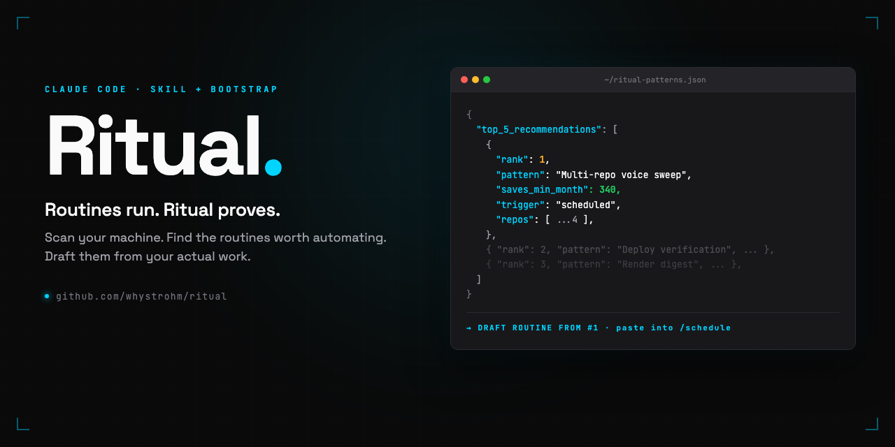
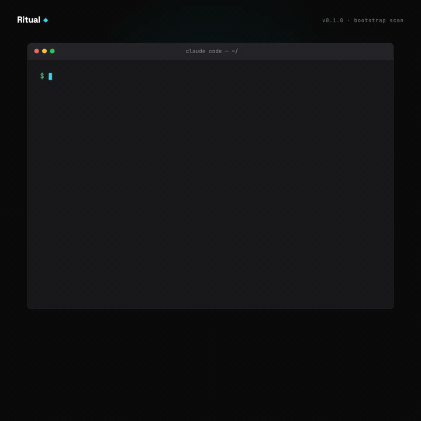
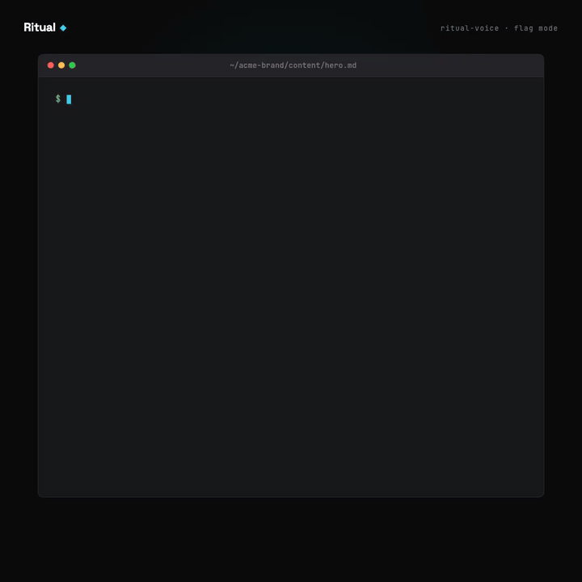

# Ritual



**Routines run. Ritual proves.**

A Claude Code skill + bootstrap scan that shows you where you're repeating yourself and **drafts your first Claude Code routine from your actual work** — real repo names, real patterns, paste-ready for Claude Code's new Routines feature. Ships with `ritual-voice`, a voice audit that enforces verified facts, canonical names, and drift-free copy across every brand you ship.

[](LICENSE)
[](https://code.claude.com)
[](https://code.claude.com/docs/en/routines)
[](https://github.com/whystrohm/ritual/actions/workflows/ci.yml)

---

## Why this exists

[Claude Code routines](https://code.claude.com/docs/en/routines) just shipped. Scheduled, triggered, and GitHub-event-driven Claude Code sessions that run without you sitting at the keyboard.

The problem: most people installing Claude Code for the first time have no idea what their first routine should be. The feature is powerful, the starting point is blank.

Ritual fills the starting point. It scans the actual work on your machine — shell history, git repos, config files — and proposes routines tailored to what you already do. The first routine most content operators should build is a voice audit. Ritual ships that too, as `ritual-voice`.

## What Ritual is

Two pieces. One repo.

**1. The bootstrap scan** ([`docs/bootstrap.md`](docs/bootstrap.md)) — a paste-in Claude Code prompt that:

- Reads your `~/.zsh_history` / `~/.bash_history` (last 180 days) and counts command frequencies
- Inventories git repos under `~/` and groups shared folder shapes
- Finds config files with overlapping schemas across 3+ repos
- Flags command sequences that appear together 5+ times (these are workflows)
- Writes findings to `~/ritual-patterns.json` with a `top_5_recommendations[]` array
- Recommends your first routine, filled in with your actual repo names and patterns

Runtime: 5–10 minutes. No network calls outside `git`. Skips `.ssh`, `.aws`, `.gpg`, `.gnupg`, any path containing `bbn`, `rtx`, `darpa`, `defense`, `classified`, `itar`, `ear`. Full safety list in [`docs/enterprise.md`](docs/enterprise.md).

**2. `ritual-voice`** — the skill the bootstrap will recommend first for most content operators. Audits any content file against a brand's voice guardrails defined in a `ritual.config.json`:

| Priority | Check | Why it matters |
|---|---|---|
| P1 | Stale stats | Misleading claims are worse than ugly ones |
| P2 | Missing specificity | "We help founders grow" is not a claim |
| P3 | AI-slop markers | Em-dash seasoning, "delve," "tapestry," "it's not X — it's Y" |
| P4 | Hype words | Comprehensive, seamless, revolutionary |
| P5 | Name/attribution mismatches | Nickname in one paragraph, legal name in another |
| P6 | Generic corporate voice | Passive headlines, hedged claims |

Three modes: **flag** (report only), **suggest** (propose rewrites), **fix** (apply them). Default mode: `suggest`. Fix mode exists for trusted invocations; scheduled routines should never use it unsupervised.

## 60-second start

**Option A — run the bootstrap first.** Recommended if you haven't built a Claude Code routine before.

1. Open Claude Code at your home directory (`cd ~`).
2. Paste the bootstrap prompt from [`docs/bootstrap.md`](docs/bootstrap.md).
3. Review `~/ritual-patterns.json` when it finishes.
4. Take the top recommendation, paste it into Claude Code's `/schedule` command, attach the repos, set a cadence.

**Option B — skip straight to voice audit.** For content operators who already know voice drift is their biggest tax.

```bash
# Download the latest skill release
curl -L https://github.com/whystrohm/ritual/releases/latest/download/ritual-voice.skill -o ritual-voice.skill

# Install in Claude Code: Settings → Skills → Install Skill → select ritual-voice.skill

# Drop a starter config in your brand's repo
curl -L https://raw.githubusercontent.com/whystrohm/ritual/main/examples/minimal/ritual.config.json -o ritual.config.json
```

Then in any Claude Code session in that repo:

> Run ritual-voice on `content/homepage.md` in flag mode.

## What the scan finds



Example output from a real operator's machine (sanitized):

```json
{
  "scanned_at": "2026-04-17T09:14:22Z",
  "scope": { "repos_scanned": 28, "files_sampled": 1847, "history_days": 180 },
  "top_5_recommendations": [
    {
      "rank": 1,
      "pattern": "You edit brand-config.json + CLAUDE.md + one page.tsx across 11 repos. Each session runs git status, git diff, git log -5, remotion studio, vercel deploy in sequence. 47 times in 90 days.",
      "routine_category": "skill+routine combo",
      "proposed_trigger": "scheduled (weekly, Monday 6am)",
      "estimated_time_saved_per_month_minutes": 340,
      "implementation_sketch": "A weekly sweep that runs ritual-voice across all content repos, opens draft PRs with fixes, and posts a summary to your messaging channel."
    },
    {
      "rank": 2,
      "pattern": "You run scripts/fetch-assets.sh with the same 3 arguments across 6 different brands. 31 times in 90 days.",
      "routine_category": "skill",
      "proposed_trigger": "manual",
      "estimated_time_saved_per_month_minutes": 85,
      "implementation_sketch": "A skill that takes a brand slug and a search query and pulls the right stock assets into the right folder."
    }
  ]
}
```

The point is that the recommendations are concrete, cite real frequencies, and name specific patterns — not generic "you should automate things" advice.

## Before / after — `ritual-voice` on real content



Representative run on a paragraph of founder-written copy:

**Before:**

> In today's fast-paced world, leveraging AI is a game-changing opportunity for forward-thinking founders. Our comprehensive platform empowers you to unlock your brand's full potential through seamless integration and cutting-edge automation.

**Ritual report:**

```
## Voice Lint Report — content/hero.md
Mode: suggest
Config: ./ritual.config.json

### Summary
- Total violations: 10
- By priority: P1=0, P2=2, P3=2, P4=6, P5=0, P6=0
- Verdict: needs-revision

### Violations (in priority order)

P2 — Missing specificity
  L1 "In today's fast-paced world"   no subject, no number, no proof
  L2 "your brand's full potential"   ungrounded outcome

P3 — AI-slop markers
  L1 "In today's fast-paced world"   bannedPhrases match
  L2 "forward-thinking"              cliche adjective stack

P4 — Hype words
  L1 game-changing, comprehensive
  L2 empower, unlock, cutting-edge, seamless
```

**Suggested rewrite pulled from `provenFacts`:**

> We run content infrastructure for eleven founder-led brands. Voice extraction, guardrails in the repo, automated publishing. Thirty minutes a week of founder time. Starting at $3,000/month.

Ten violations down to zero. Same pitch, different surface. The rewrite pulls specificity from the config's `provenFacts` — every number in the new version maps to a verified fact with a source, not invented proof.

## Pair with a routine

The skill gets real leverage when a Claude Code routine invokes it on a schedule. Full prompts for three routine patterns (scheduled sweep, GitHub PR review, API pre-publish gate) are in [`docs/routines.md`](docs/routines.md). Minimal scheduled sweep:

```
## Context Reset
Disregard prior conversation state. Your scope is defined entirely below.

## Task
Invoke the ritual-voice skill on all markdown and MDX files in /content,
/blog, and /case-studies. Use "suggest" mode. Open a draft PR per brand
with proposed fixes. Never auto-merge. Post a summary to the release
channel naming: repos scanned, repos clean, repos with PRs opened.

## Termination
After the summary is posted, stop. Do not continue into related work.
```

Set a daily schedule. Review PRs with coffee.

## The config file

Your `ritual.config.json` is the heart of the system. The skill itself has zero brand-specific logic — everything lives in the config. Minimal version:

```json
{
  "brand": {
    "name": "Acme",
    "tone": "direct, specific, no fluff"
  },
  "canonicalNames": {
    "Ty": "Tyler Robinson",
    "Tyler": "Tyler Robinson"
  },
  "voice": {
    "bannedWords": ["comprehensive", "seamless"],
    "examples": [
      "We ship 400 videos a quarter from a single config file.",
      "30 minutes a week. One operator. No agency."
    ]
  },
  "provenFacts": [
    {
      "claim": "400 videos shipped in Q1",
      "verifiedAt": "2026-04-10",
      "source": "Remotion render logs"
    }
  ],
  "staleness": {
    "maxAgeDays": 30,
    "metricsRequireVerification": false
  }
}
```

See [`docs/config-schema.md`](docs/config-schema.md) for the full schema.

## Enterprise posture

Ritual is designed for operators running content across multiple brands, products, or business units. Full enterprise brief in [`docs/enterprise.md`](docs/enterprise.md). Summary:

- **Configs live in repos.** Version-controlled, reviewable, auditable. No external dashboard.
- **Skill is portable.** A single `.skill` file. No dependencies, no package manager. Install once per team member.
- **Provenance is explicit.** Every flagged claim points at the fact (or absence of fact) in the config. Audit trail, built in.
- **Exempt paths are honored.** Defense, classified, private — the config tells the skill what not to touch. Contents of exempt paths are never sent to the model.
- **No network calls.** The skill runs inside Claude Code. The bootstrap scan uses `git`, `rg`, `fd`, and filesystem reads only.
- **Fix mode is opt-in per invocation.** Scheduled routines default to `suggest` mode. Auto-fix never runs unsupervised.

For the full list of what Ritual will and will not do, see [`docs/limitations.md`](docs/limitations.md).

## Examples

- [`examples/minimal/`](examples/minimal/) — bare-bones config to start from; `provenFacts` empty, `metricsRequireVerification: false`
- [`examples/whystrohm/`](examples/whystrohm/) — mature reference config for a multi-brand content consultancy; three verified facts sourced from the live site, strict verification on

## Roadmap

- **`ritual-voice`** (this skill) — voice and claims auditor. *Current.*
- **`ritual-media`** — media intake and asset organization. Normalizes dropped files into the brand's folder shape, tags, routes to the right config. *Planned, but only if the bootstrap scans start surfacing it as a common pattern across operators.*
- **`ritual-launch`** — launch-day checklist runner. Verifies every channel before a campaign goes live. *Planned, same condition.*

The deliberate pattern: we ship what the scan tells us to ship. If you run the bootstrap and find a repeated pattern we haven't captured, open an issue with the top three lines of `~/ritual-patterns.json` (sanitized) and we'll discuss.

## Contributing

PRs welcome. See [CONTRIBUTING.md](CONTRIBUTING.md).

The skill itself is intentionally small — the leverage is in your `ritual.config.json`, not in the skill code. If you're building something that would be useful for other brands, the single most valuable contribution is an example config for your niche.

## Security

Vulnerability reports: email **security@whystrohm.com**. See [SECURITY.md](SECURITY.md) for scope, disclosure process, and signed-release verification.

## License

MIT. See [LICENSE](LICENSE).

---

Built by [WhyStrohm](https://whystrohm.com) — managed content infrastructure for founder-led brands. If you want this running against your content without maintaining it yourself, that's the service.
